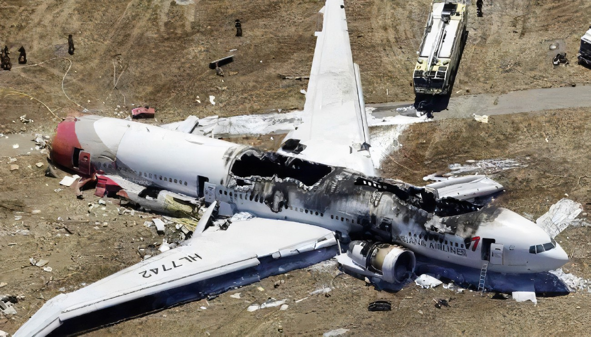

# Proyecto Integrador de Data Analytics 
El presente proyecto hecho para la academia HENRY trata sobre los accidentes aéreos que se suscitaron entre el año 1909 y el 2021. Como objetivo se pretende demostrar algunas relaciones entre las muertes, accidentes según operadores aéreos, tipos de aeronaves con más accidentes y décadas en la que hubo mayores incidencias de este tipo 

## Procesos 
 Se realizaron diferentes procesos al documento csv que contenía los datos para llegar a un análisis más adecuado y sin errores de la base de datos en general
### ETL (Extracción transformación y carga)
Se hizo un pequeño proceso de ETL con el fin de poder eliminar datos duplicados, extraer los países donde sucedieron los accidentes, extracción de las horas para saber si el accidente ocurrió en la mañana o en la noche y demás transformaciones relevantes que ayuden a tener un Análisis exploratorio de datos prolijo
### EDA (Análisis exploratorio de datos)

El EDA se realizó con las librerías más populares de python para visualización de datos como Seaborn, dentro los hallazgos más relevantes en esta etapa del proceso de análisis de datos destacan:
- Existen muchos valores outliers, de la cantidad de fallecidos total de cada accidente
- Entre los años 1970 y 1990 existen una mayor cantidad de fallecidos por el total de accidentes de avión que sucedieron
- El país en donde sucedieron más accidentes con mayor cantidad de fallecidos, fue USA, seguido por Rusia y como tercero Brasil
- La aeronave Douglas DC-3 fue la que más accidentes y mayor cantidad de fallecidos totales tuvo a lo largo del tiempo
- Hubo una mayor cantidad de accidentes de día (entre las 6am y las 6pm)
- La operadora Aeroflot es la que registra más accidentes de todas las operadoras
